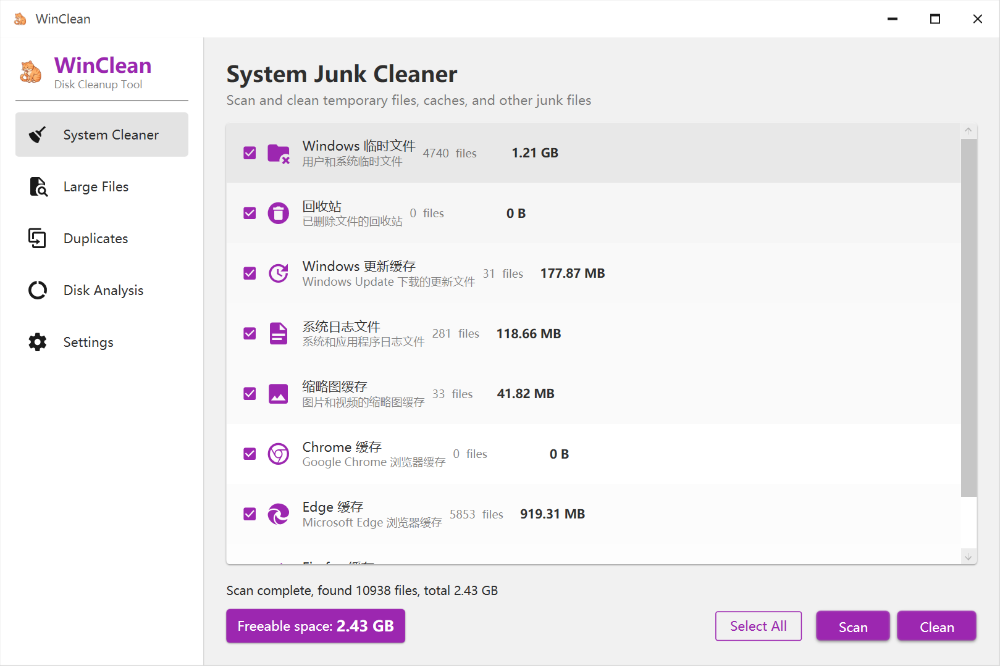
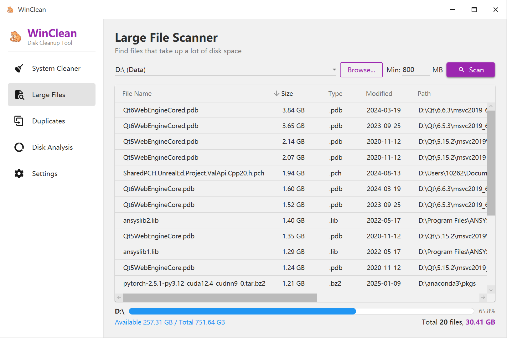
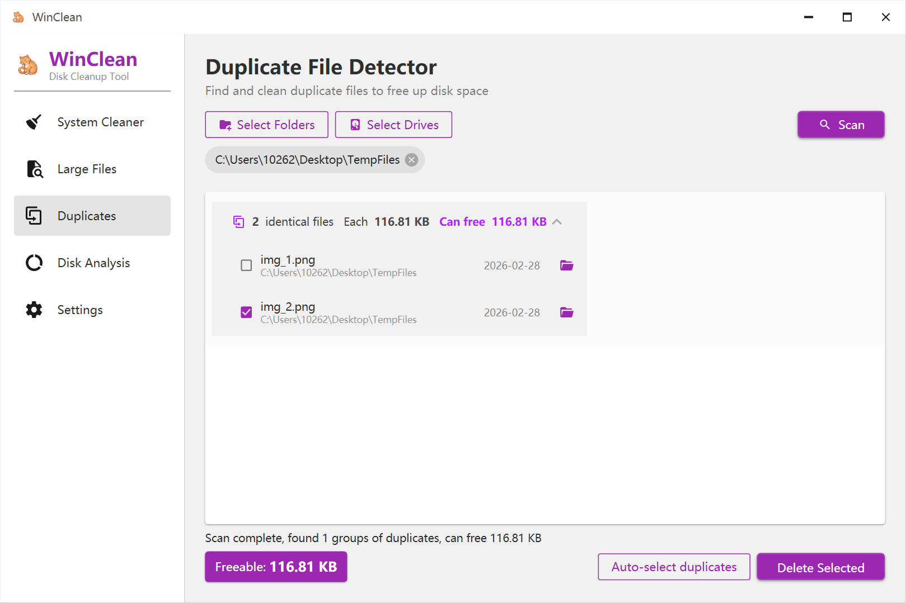
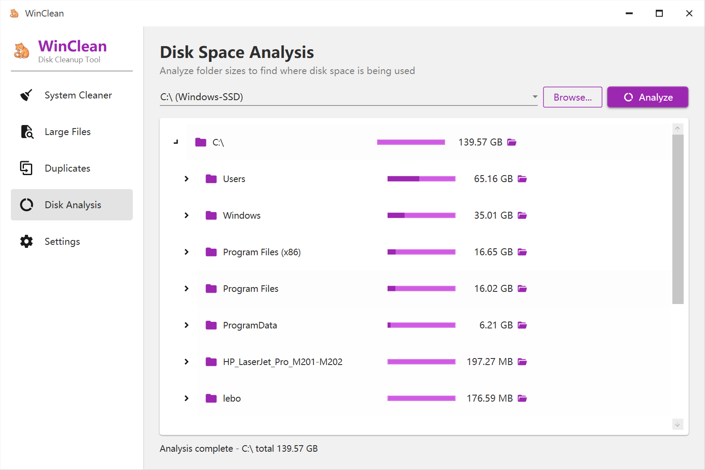
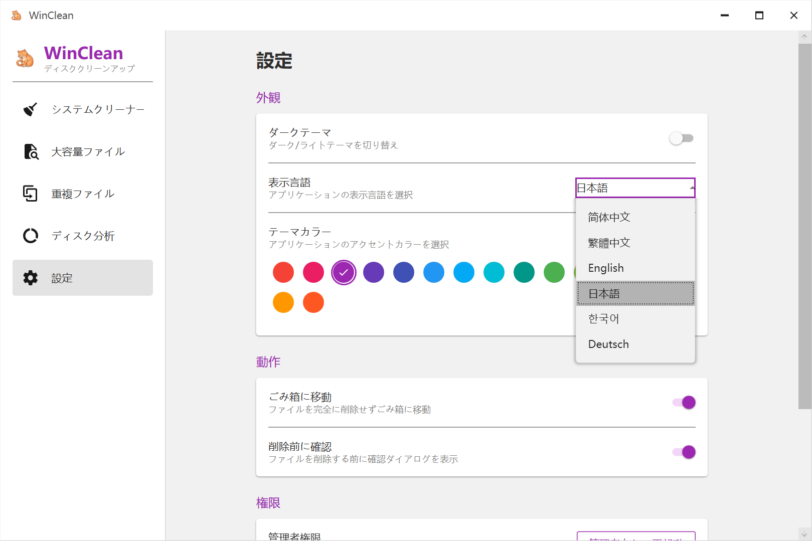

<p align="center">
  
</p>

<h1 align="center">WinClean</h1>

<p align="center">
  <strong>Clear Clutter, Claim Space.</strong><br>
  轻量级 Windows 磁盘清理工具
</p>

<p align="center">
  <a href="https://github.com/shaoyidi/WinCleanCat/releases"></a>
  
  
  
  
</p>

<p align="center">
  <a href="#features">Features</a> •
  <a href="#screenshots">Screenshots</a> •
  <a href="#download">Download</a> •
  <a href="#build">Build</a> •
  <a href="#sponsor">Sponsor</a>
</p>

---

## ✨ Features

🧹 **System Junk Cleaner** — Clean temporary files, browser caches, Windows update caches, system logs, thumbnails, and more.

🔍 **Large File Scanner** — Find the largest files on any drive with custom size thresholds and real-time disk usage display.

📋 **Duplicate File Detector** — Detect duplicate files using SHA256 hash comparison with multi-threaded scanning across multiple drives.

📊 **Disk Space Analysis** — Visualize disk usage with an interactive tree view to see exactly where your space is being used.

🌍 **6 Languages** — Simplified Chinese, Traditional Chinese, English, Japanese, Korean, and German.

🎨 **Customizable Themes** — 10+ theme colors, dark/light mode, with preferences auto-saved.

## 📸 Screenshots

<table>
  <tr>
    <td></td>
    <td></td>
  </tr>
  <tr>
    <td align="center"><strong>System Junk Cleaner</strong></td>
    <td align="center"><strong>Large File Scanner</strong></td>
  </tr>
  <tr>
    <td></td>
    <td></td>
  </tr>
  <tr>
    <td align="center"><strong>Duplicate File Detector</strong></td>
    <td align="center"><strong>Disk Space Analysis</strong></td>
  </tr>
  <tr>
    <td></td>
    <td></td>
  </tr>
  <tr>
    <td align="center"><strong>Settings (Multi-language & Themes)</strong></td>
    <td></td>
  </tr>
</table>

## 📥 Download

Download the latest version from [GitHub Releases](https://github.com/shaoyidi/WinCleanCat/releases).

- **Installer**: `WinClean_Setup_x.x.x.exe` — Full installer with shortcuts
- **Portable**: `WinClean.exe` — No installation required

> **Requirements**: Windows 10/11 x64. Self-contained, no .NET runtime needed.

## 🔨 Build

```bash
# Clone the repository
git clone https://github.com/shaoyidi/WinCleanCat.git
cd WinClean

# Run directly
dotnet run --project src/WinClean/WinClean.csproj

# Build installer (requires Inno Setup)
build.bat

# Build MSI package (requires WiX Toolset)
build-msi.bat
```

### Tech Stack

- **Framework**: .NET 8 + WPF
- **UI Library**: Material Design In XAML
- **Architecture**: MVVM (CommunityToolkit.Mvvm)
- **DI**: Microsoft.Extensions.DependencyInjection
- **Logging**: Serilog

## 💜 Sponsor

If WinClean is helpful to you, consider supporting its development! / 如果 WinClean 对你有帮助，欢迎支持！

### 🇨🇳 微信赞赏

<p align="center">
  
</p>

### 🌐 International Payment \[Coming Soon\]

> International payment channel is under preparation. Stay tuned!
>
> 海外支付渠道正在筹备中，敬请期待！

### Other ways to support / 其他支持方式

- ⭐ **Star** this repository / 给仓库点 Star
- 📢 **Share** WinClean with friends / 分享给朋友
- 🐛 **Report** bugs or suggest features via [Issues](https://github.com/shaoyidi/WinCleanCat/issues) / 提交 Bug 或建议

## 📄 License

[MIT License](LICENSE) © 2026 WinClean
